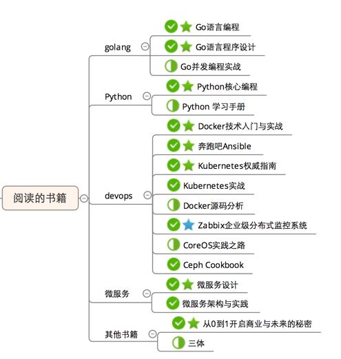
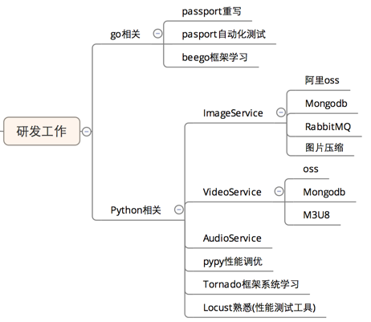
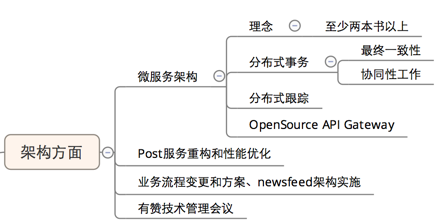
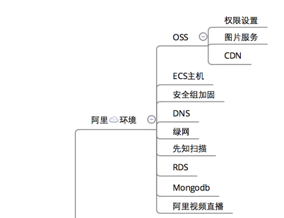
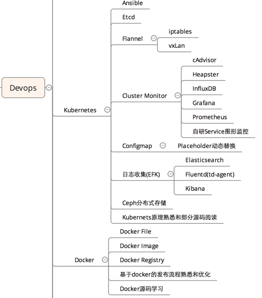
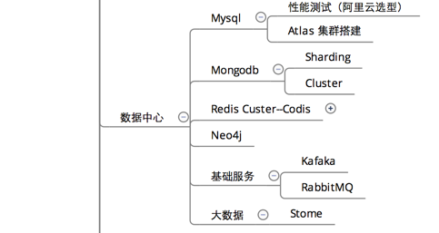
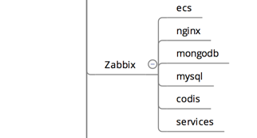
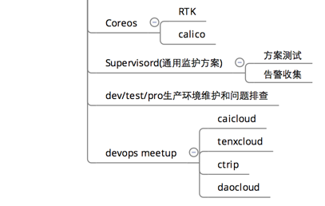

# 2016年总结

## 1. 引子

 

>（绿色星星的表示精读）

通过阅读的技术书籍也极好地反应出了2016年工作中涉及到的主要技术和工作的重点：

1. 接触Golang，进行了初步的系统学习，重构了Passport服务，为Docker和K8S的开展打了一个基础；
2. 使用Python作为主要编程语言，编写和维护了几个阿里OSS相关的服务；
3. 在Devops投入的精力最大，系统学习了Docker + Kubernets，以及其所涉及的相关技术Ansbile、Ceph、Zabbix监控等等；牵制精力最大的主要原因是Devops同事集体离职和自己首次接触Devops，对于各个环节上都是hello world的阶段；
4. 由于整体系统采用了微服务架构，对于微服务的架构使用、功能合理划分，分布式事务、分布式的调用跟踪等个个方面也遇到了比较大的挑战；
5. 由于陪产假和国庆假连在了一起，有了较多的空余时间，抽空阅读了《从0到1》，阅读完的确是获取了比较大的思维扩展；《三体》，自不用说，尽管已经阅读了一半，已经是脑洞打开了；

## 2. 工作

### 2.1 R&D && Arch

开始入门Golang语言，使用Beggo框架重构了Passport服务；重拾Python，学习了Tornado框架以及相关的异步库、负责维护OSS相关的几个服务，通过精读《Python核心编程》，已经可以将Python列入了常规编程语言，也逐步熟悉了Rabbitmq和Mongodb，逐渐地也能尝试帮助同事解决些Python的疑难杂症，果然是学习过C/C++，可以秒杀大部分其他语言的相关问题；

存在的不足：由于Golang在公司后台开发中属于非常小众的语言，小到只有Passport这个服务采用了Golang（历史原因），公司也只有自己一个人在使用Golang，Golang在实际项目中的应用有些偏少，没有可以沟通的同事，多数都是自己在自我驱动学习，包括对于Docker和K8S的源码阅读，也都没有进入到公司项目层次；另外自己还要负责Python相关的几个服务，学习Python也牵制了不少的学习精力。

整个系统采用微服务架构，每个服务编写起来功能内聚得到了很好的解决，提供了统一的Restful API，不同的服务完全可以根据自己的喜好选择不同的语言和存储，部署和扩容上都灵活了很多，看起来一切都很美，但是分布式的固有复杂性却没有得到解决，分布式事务的处理，依然是一个比较头痛的问题，如论是采用那种最终一致性方案都是复杂性比较大，需要重点关注；同时对于微服务之间的调用链跟踪的可视化跟踪，尽管基于Google的Dapper论文有了相当多的开源方案，但是牵扯到各种语言实现和微服务逻辑，仍然需要投入一定的精力去解决；鉴于此在微服务采用初期的框架选型和统一跟踪方案是非常有必要的，可以参见[分布式跟踪系统调研](http://www.do1618.com/archives/757)。

其次微服务的Gateway除了具备服务发现基本功能外，对于安全的鉴权、流量限速、流量统计等方面也需要提供相当的支撑，可以参考[开源的Gateway实现](http://www.do1618.com/archives/783) 

### 2.2 Devops

Devops上无疑是投入的精力最大，短期内直接从0起步负责Devops的整体工作，到处都是各式各样新名词新概念，而且还要短期内达到可以维护和生产环境中可以使用，初期面临着比较大的挑战和压力；学习的方面主要是围绕着以下几个方面：

#### 2.2.1 阿里云相关技术及熟悉

从阿里的ECS开始，全面熟悉了阿里相关的各种服务，数据类包括RDS、Mongdb和OSS存储；安全类包括安全组加固、先知扫描；涉黄涉政类的绿网使用；再到2016火的不能再火的直播；

总体体会上感觉阿里的管理功能做的非常不方便，工单的响应的及时性和准确性上都有待较大的提高。中间遇到过两次安全组不生效、OSS权限设置不能正常工作的情况。

#### 2.2.2 Docker && Kubernets（K8S）

Docker和K8S无疑是2016年的重中之重，各个生态圈都有相当多的内容需要去关注和熟悉，且两者都经历则快速的发展，紧跟着形势走都需要大量的精力投入；另外一个方面，两者的每个方案的调整都可能导致CI/CD流程的调整和优化，牵一发动全身。

Docker的简单使用相对比较简单，但是在生产环境中的使用则需要考虑着更多的方面的：DockerFile的优化、DockerImage在CI/CD层次上的组织、DockerRegistry的存储、删除，安全和权限控制等个个方面都需要统筹考虑；另外基于Docker化的编译环境梳理、发布过程中的代码lint、uint test和自动化的集成测试都需要针对不同的语言进行定制化维护，同时在Jenkins中的发布流程的Pipeline也需要Docker化的强力支持，可能用到Docker in Docker 或者Docker outof Docker之类的方案。

Kubernets则是Google集群神器Borge的开源实现，集聚了Goolge大规模的集群管理的精华，自动调度、服务故障自动迁移、收缩扩容异常方便，但是从安装到集群维护都是一个重量级的工作，这也是很多公司不敢采用K8S的一个主要原因；Ansbile的自动化安装、Etcd集群的搭建和维护、各种Overlay Network方案、集群监控和日志收集都需要有相当的精力进行研究。

Kubernets集群中两个重头戏则是集群的监控和日志的收集，集群的监控方面官方的公开方案是基于cAdvisor的Agent，采用Heapster进行统一收集，保存到Influxdb，界面上采用Grafana展示，但是想要在生产环境中进行稳定运行，还是要注意各个版本的兼容和各种的Crash Restart，不小心就会踩到坑；容器的日志收集采用的是EFK方案，从各种样式的日志收集Format统一到聚合，再到查询搜索、报表统计各个环境上都需要进行跟踪，否则会经常出现漏采集日志、日志过多的时候Fluentd狂占CPU、Kibana搜索导致Memroy Overload的情况。

需要完善的地方：

1. EFK为针对Docker服务和K8S中各组件的收集，导致问题排查的时候仍然需要Ansible命令去各Node上进行采集日志分析；
2. 容器长期运行中的日志管理也未进行统一的策略管理，导致长期一直运行的容器日志会越写越大，导致磁盘空间的占用；
3. 针对K8S中的各种Event为进行针对性跟踪和告警，需要采用K8S的API Watch方式进行采集和分析，统一到Zabbix告警平台；
4. 对于业务Service的运行状态和连通性测试，只是提供了一个简单的页面，定时进行生产和刷新，功能比较简单且易用性不强；
5. Flannel的Overlay网络开销和KubeProxy的Iptables的转发，在对延时敏感性的业务上还是有比较大的影响，应该尽量避免，特别是基于Iptables的消息转发和封装，都不太利于问题的跟踪和排查；后期可以考虑Calico的三层路由网络；

对于K8S集群的优化还有相当多的工作需要做，更多工作的开展就牵扯到对于集群内部运作原理和源码层次的熟悉，需要有专门的人力进行持续的跟踪和优化；

#### 2.2.3 DataCenter（缓存集群和数据集群）

数据中心的搭建和维护是整套系统的重点，Mysql集群搭建和测试、Mongodb Cluster的搭建和测试，缓存集群Codis搭建和测试；基础服务方面还包括Rabbitmq和Kafka；另外还有图形数据库Neo4j和大数据Strorm集群的搭建。

个人而言自己重点在Mysql、Codis、Rabbitmq三个上，其他的也还都是停留着简单的接触；

需要完善的就是Mysql的高可用、备份和恢复；Codis缓存方面的快速扩容和节点状态Health监控。数据中心的每个方案上都需要有时间的校验和大量的工作去完成。毕竟数据才是企业的源头和发动机。

### 2.2.4 Zabbix监控系统

基于开源的Zabbix系统，功能包括了阿里ECS主机的常规监控、Nginx Status监控、Mongodb Status、Mysql Staus、Codis（Redis Cluster）和Services Health Check的功能。

需要进一步完善的地方就是没有完整实现对于Services的API的全面检测，导致部分业务不能正常工作的时候不能够第一时间定位和修复。改善的方案可以部署一个简单的Cient实现核心业务的模拟器，独立于整套环境外对于API响应的状态码和响应时间做针对性的监测，使用Zabbix的告警通知机制，可以方便的修复相关的故障业务。

### 2.2.5 Devops其他工作

在Devops其他方面上整理一套基于Supervisord的监控和告警方案；CoreOS的相关内容熟悉，CoreOS现在已经修改名字为了Container Linux，提供了高度的安全性和K8S的高度集成，未来的CAAS角色不可估量；于此同时还维护了dev/test/pro三套环境的日常维护，从当初的各种救火，到现在的基本稳定，一次次的方案调整效果还是相当明显；采取走出去的方针，参见了多次的线下Meetup，不仅开阔了视野也结交了相当多的志同道合的好友。

### 2.3 Blog

2016年坚持着写Blog的习惯，从2月份开始，大概有100篇左右，虽然有些文章的质量有待提高，有总胜于无，一路坚持总有收获。

## 3. 生活

在生活2016年无疑是最充实的一年，经历着宝宝在妈妈肚子里一天天长大，一次次的胎动、一次次和打仗一样的孕检、到宝宝呱呱落地、满月、3个月....

2016年的中心就是这个可爱的大宝宝，每次看到宝宝那萌萌的表情，感觉一切的等待和辛苦都是那么值得，那么幸福......

