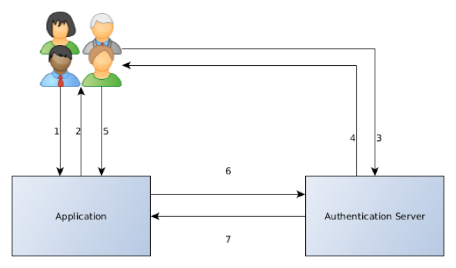
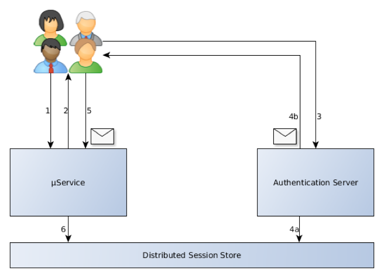
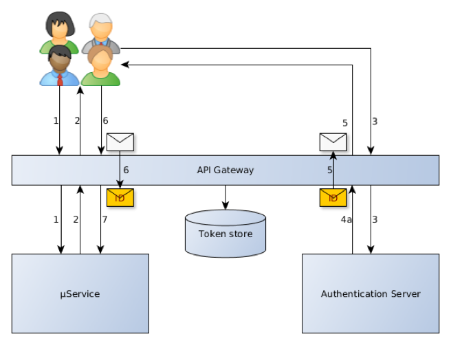

# Microservices Authentication and Authorization 


## 1. Protocol 

1. Oauth2 - RFC 6749

   > “The OAuth 2.0 authorization framework enables a third-party application to obtain
   > limited access to an HTTP service, either on behalf of a resource owner by
   > orchestrating an approval interaction between the resource owner and the HTTP
   > service, or by allowing the third-party application to obtain access on its own
   > behalf.”

2. Oauth2 - Beare Token usage - RFC 6750

   > “This specification describes how to use bearer tokens in HTTP requests to access
   > OAuth 2.0 protected resources. Any party in possession of a bearer token (a
   > "bearer") can use it to get access to the associated resources
   > (without demonstrating possession of a cryptographic key). To prevent misuse,
   > bearer tokens need to be protected from disclosure in storage and in transport.

3. OpenID Connect (OIDC)

   > “OpenID
   > Connect 1.0 is a simple identity layer on top of the OAuth 2.0 protocol. It
   > enables Clients to verify the identity of the End-User based on the
   > authentication performed by an Authorization Server, as well as to obtain basic
   > profile information about the End-User in an interoperable and REST-like manner.” 


### Tokens: Type/Format

1. **AccessToken**

   * Part of Oauth, presented with each transaction
   * can be opaque or JWT
   * can be stateful or stateless
   * Shorter TTL

2. **RefreshToken**

   * Partof Oauth,received along with first access token after authentication to the authserver
   * Used to request a new access token from the auth server, no credentials required
   * LongerTTL
   * Must be stored securely

3. **ID Token**

   * Partof OIDC
   * ContainsIdentity information about authenticated user
   * Receivedin addition to the 2 oauth tokens
   * Mustbe JWT
   * LongerTTL

4. **JSON Web Tokens(JWT)**

   * Token format specified by OpenID Connect for the Identity Token

   * Multiple levels of security possible (JWE, JWS, JOSE)

   * Usually stateless

     ​

## 2. Tokens: Performance vs. Security


**Stateful**

* Sessions stored on server
* Tokenis opaque
* Tokens must be validated with the server
* Server handles authorization
* Better logout


**Stateless**

* Sessions not stored on server

* Token may be introspected

* Tokens validated locally

* Microservice must handle authorization

* Tokens difficult to revoke before TTL

  ​

| Token                    | Performance | Security  |
| ------------------------ | ----------- | --------- |
| State                    | Stateless   | Statefull |
| Encrypt  JWT Body        | No          | Yes       |
| Validate  w/Auth  server | No          | Yes       |
| Validate  all tokens     | No          | Yes       |
| TTL’s                    | Longer      | Shorter   |


Decode JWT: https://jwt.io/

```sequence
Title: Oauth Bearer Token - stateful
mservice1 -> authserver: 1. RequestToken（Client Credenitals） 
authserver -> mservice1: 2. Resonse（access token, refresh token, metadata)
mservice1 -> mservice2: 3. SrvRequest（access token)
mservice2 -> authserver: 4. Token Validation Request(Client Credentials, access token)
authserver -> mservice2: 5. Response (token_epires)
mservice2 -> mservice1: 6. Response {payload data}


```

```sequence
title: Tier 1 and 2 microservices - stateless
ExternalConsumer -> Tier1_application: Request proteceted app
Tier1_application -> ExternalConsumer: 302 Redirect- Auth-Server
ExternalConsumer -> AuthServer:
AuthServer -> ExternalConsumer: 302 Redirect-w/auth code
Tier1_application -> AuthServer: Auth Code
AuthServer -> Tier1_application: {access token, refresh token, ID Token metadata}
Tier1_application -> AuthServer: Request Token(Client Credentials)
AuthServer -> Tier1_application: Response (access token, refresh token, metadata)
Tier1_application -> Tier2_application: Service Request(consumer access token, \nconsumer IDToken, servcie access token)
Tier2_application -> Tier2_application: Stateless token validated
Tier2_application -> Tier1_application: Response(data payload)
Tier1_application -> ExternalConsumer: (data payload)


```


## 3.  Authentication Ways

### 3.1 Use SSO solutions



1. User requests access
2. Not authenticated
3. User authenticattes with SSO Server
4. Authentication successful, grant token
5. User uses token
6. Application uses token to get user details 
7. Auth Server returns user details

### 3.2 Distributed session



1. User requests access
2. Not Authenticated
3. User authenticates with Auth Server
4. Authentication successful
   * Write state to Distributed Session Store
     * User X is logged in
     * Sets TTL
   * Set Session ID on client side
5. User uses Session ID
6. μService read distributed Session Store
   * Refresh TTL

## 3.3 Client-side token


1. User requests access
2. Not authenticated
3. User authenticates with AuthServer
4. Authentication successful
   * Set ID token on the client side
     * Self-contained
     * Signed
     * TTL
5. Services understand ID token
   * Can parse user ID
   * Can verify token
     * Check signature
     * Check TTL


### 3.4 Client-side token + API Gateway




1. User requests access
2. Not authenticated
3. User authenticates with AuthServer
4. Authentication successful
   * Set ID token on the client side
     * Self-contained
     * Signed
     * TTL
5. API Gateway translates to opaque token
6. API Gateway resolves to ID token
7. Services understand ID token
   * Can parse user ID
   * Can verify token
     * Check signature
     * Check TTL

#### 3.5 Summary

|                       | SSO  | Distributed Session | JWT  | API GW |
| --------------------- | ---- | ------------------- | ---- | ------ |
| Security              | ✔    | ✔                   | !    | ✔      |
| Secret sharing        | ✔    | ✘                   | !    | !      |
| Statelessness         | ✘    | ✔                   | ✔    | !      |
| SPOF @ service switch | ✘    | !                   | ✔    | ✔      |
| Bottlenecks           | !    | ✘                   | ✔    | !      |
| Transparent           | ✔    | ✔                   | ✔    | ✔      |
| Logout                | ✘    | ✔                   | !    | ✔      |
| Technologies          | ✔    | ✘                   | ✔    | !      |
| Integration           | ✔    | ✘                   | ✔    | ✔      |
| Implementation        | ✘    | !                   | ✔    | ✘      |

