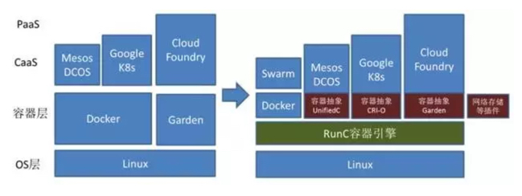
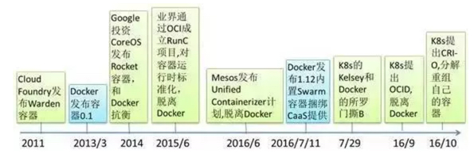
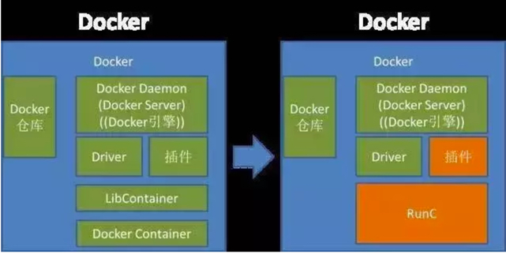
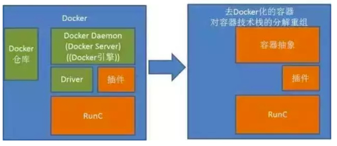
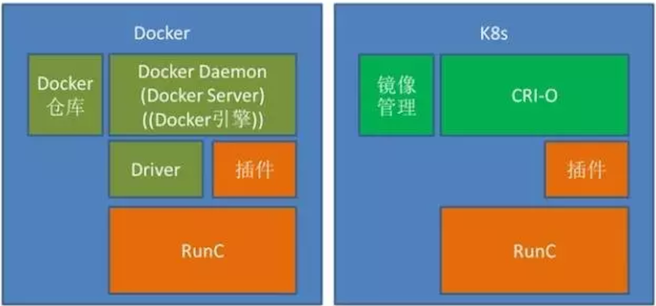
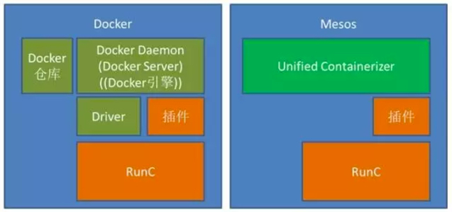
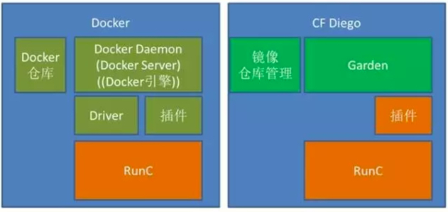

# 容器知识点梳理
## Docker不能解决的问题

环境一致性，配置相关的问题
Devops
发布流程和联合发布

## 容器引擎：
1. Docker Engine
2. Coreos Rocket（Rkt),
3. Cloud Foundry Garden  

==> 

OCI(Open Container Initiative) RunC  [OCF(Open Container Format)]

测试和开发环境用Docker，但是生产环境中最好用Runc

## 演进
总体演进图：

### Libcontainer -> RunC (Docker 1.11) 
插件主要包括： 安全认证、存储卷管理、网络、IP池

##### CaaS生态厂商通过容器抽象、RunC和插件来重组自己的容器技术堆栈示意图

##### Kubernetes通过CRI-O取代Docker容器管理引擎架构
CRI-O (CRI=Container Runtime Interface O=OCI)

##### Mesos通过UnifiedContainer取代Docker容器管理引擎

##### Cloud Foundry通过Garden取代Docker容器管理引擎

Docker网络解决方案包括Docker CNM(Container Network Model)和Coreos CNI(Container Networking Interface)。

CNM是一个被 Docker 提出的规范。现在已经被Cisco Contiv, Kuryr, Open Virtual Networking (OVN), Project Calico, VMware 和 Weave 这些公司和项目所采纳。

CNI是由CoreOS提出的一个容器网络规范。已采纳改规范的包括Apache Mesos, Cloud Foundry, Kubernetes, Kurma 和 rkt。另外 Contiv Networking, Project Calico 和 Weave这些项目也为CNI提供插件。

扩展阅读：

* [容器网络聚焦：CNM和CNI](http://www.dockerinfo.net/3772.html)
* [为什么Kubernetes不使用libnetwork](http://www.infoq.com/cn/articles/why-Kubernetes-doesnt-use-libnetwork)

经典连接：

* [容器，你还只用Docker吗？（上）](http://mp.weixin.qq.com/s?__biz=MzA5OTAyNzQ2OA==&mid=2649692608&idx=1&sn=ae5dd2d8ee1dcc3d1d96a9fa79816d66&chksm=889326a3bfe4afb5759f47ad71f007c1274a12067528ff503b5c54f2f5cf25758ef0c5f5a433&scene=21#wechat_redirect)
* [容器，你还只用Docker吗？（下）](http://mp.weixin.qq.com/s?__biz=MzA5OTAyNzQ2OA==&mid=2649692634&idx=1&sn=23d4b8583402ed3bff5037ad988ae4b2&chksm=889326b9bfe4afaff42d07d5d02129ab1d8d2335e59aafa48710c4735c29429863bbeb29b94b&mpshare=1&scene=1&srcid=1130CBfSe89p25Ophga834vk#rd)