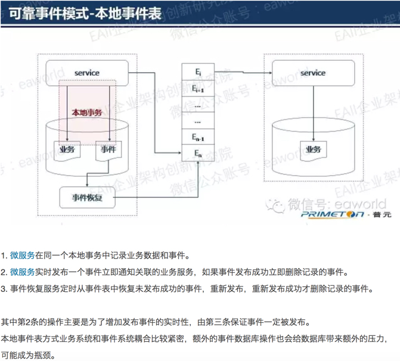
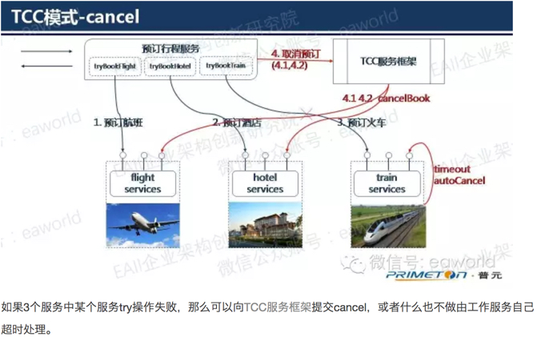

# 分布式事务一致性

## 1. 概述

为了保证异常情况的处理，系统最终还应该设置最终的对账系统进行一致性检查。

## 2.模式详解
### 2.1 可靠事件模式

可靠事件模式是通过消息机制的传递来保证事件的最终处理一致性，主要有两点要求：

1. 可靠的消息传递机制，保证产生的事件消息能够准确地到达后续处理业务，至少有一次的传递。
2. 避免重复事件消息处理，消息重复处理的幂等性，后续业务作为消费者可能消费到重复的事件消息，要保证重复消息的处理的幂等性。

一般来说对于消息传递过程需要添加一个中间事件表，以保证业务崩溃或者网络出错的情况下，未能够投递的事件消息进行重新投递或者取消，可以采用 本地事件表和外部事件表的方式。

本地事件表：

外部时间表：

### 2.2 补偿模式

增加一个协调服务（补偿框架），协调服务负责生产全局唯一的业务流水号，并将业务处理流程中的数据保存到相关表中(大表或者关联表)对于出现异常的业务，根据业务表定位出需要补偿的范围，并启动补偿业务流程，通过重试来保证补偿过程的完整。

对于重试机制设置合适的策略：
1. 重置重试，业务失败
2. 立即重试，罕见错误（数据格式或者网络出错）
3. 等待重试，系统繁忙 http500

备注： 因为补偿模式确定补偿范围的复杂性和资源不具备隔离性，因此应当从业务层面给予规避，尽量提供出其他备选方案而不是进行补偿。

### 2.3 TCC(Try-Confirm-Cancel)模式
TCC模式是优化的补偿模式。TCC模式在一定程度上弥补了补偿模式中资源不具备隔离性的缺陷，在TCC模式中直到明确的confirm动作，所有的业务操作都是隔离的（由业务层面保证）。另外工作服务可以通过指定try操作的超时时间，主动的cancel预留的业务资源，从而实现自治的微服务。

服务提交confirm失败（比如网络故障），那么就会出现不一致，一般称为heuristic exception。
需要说明的是为保证业务成功率，业务服务向TCC服务框架提交confirm以及TCC服务框架向工作服务提交confirm/cancel时都要支持重试，这也就要confirm/cancel的实现必须具有幂等性。如果业务服务向TCC服务框架提交confirm/cancel失败，不会导致不一致，因为服务最后都会超时而取消。

另外heuristic exception是不可杜绝的，但是可以通过设置合适的超时时间，以及重试频率和监控措施使得出现这个异常的可能性降低到很小。如果出现了heuristic exception是可以通过人工的手段补救的。

相关链接：

1. [微服务架构下的数据一致性保证（一）](http://mp.weixin.qq.com/s?__biz=MzI5MDEzMzg5Nw==&mid=2660392782&idx=1&sn=d28e43bf6f7cf140eed9fffcf2f29e86&mpshare=1&scene=1&srcid=03125Ta3vkcVeYzePBZ4HYba#rd)
2. [微服务架构下的数据一致性保证（二）](http://mp.weixin.qq.com/s?__biz=MzI5MDEzMzg5Nw==&mid=2660392867&idx=1&sn=7f751483271fbe2b25d103df1eb45977&mpshare=1&scene=1&srcid=0311P03RSqbzRmzCG2IN8Nak#rd)
3. [微服务架构下的数据一致性保证（三）：补偿模式](http://mp.weixin.qq.com/s?__biz=MzI5MDEzMzg5Nw==&mid=2660392948&idx=1&sn=11602f1258af8bbf88322558aa8a2f21&mpshare=1&scene=1&srcid=0311lBAsg4FfdDRAKXJeUxYo#rd)